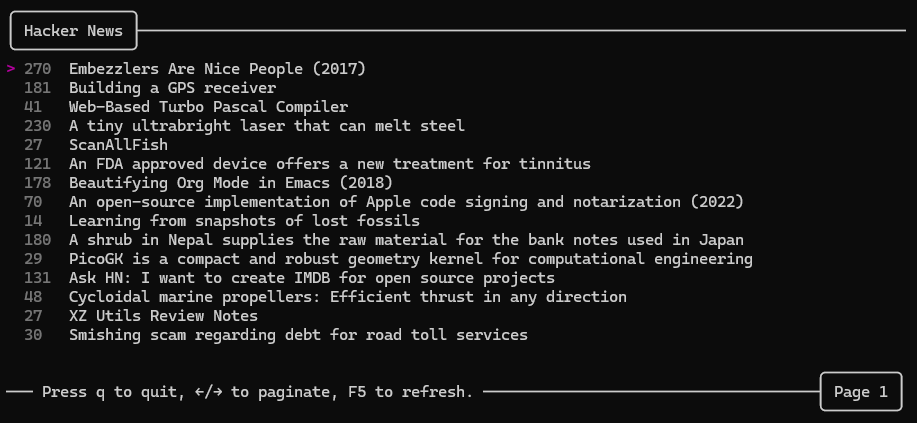
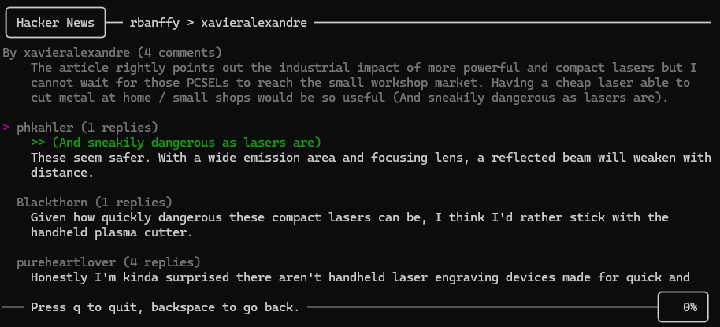

# hn
Yet [another](https://github.com/donnemartin/haxor-news) CLI tool to browse the top posts on Hacker News using [their API](https://github.com/HackerNews/API). This project was just an excuse to brush up on golang and to get some more experience working with TUIs and the vscode debugger.

## Usage

Either grab a binary from a [release](https://github.com/dominickp/hn/releases) and add it to your PATH or clone this repo and run `go run .` or `go install`.
